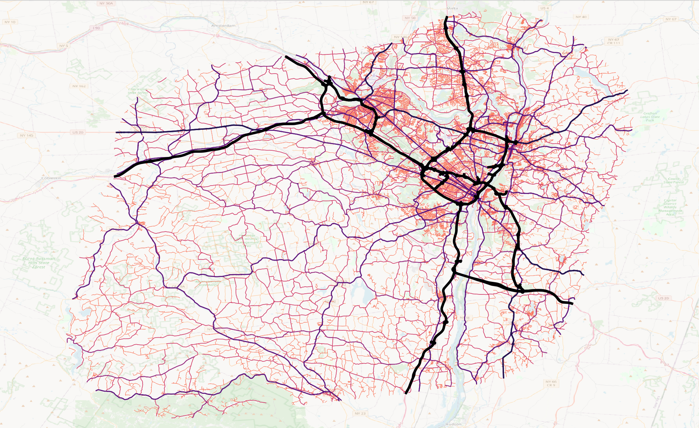
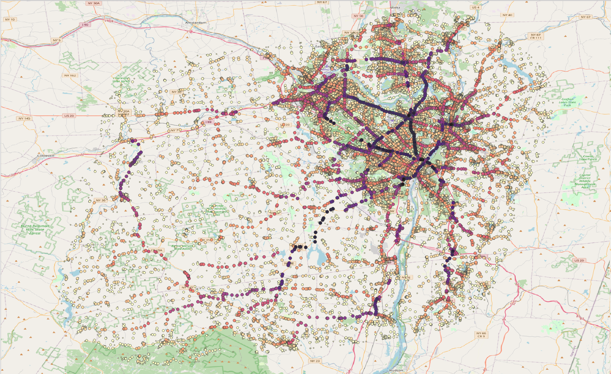
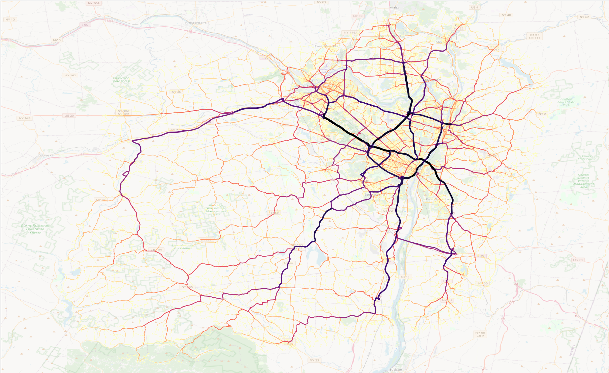
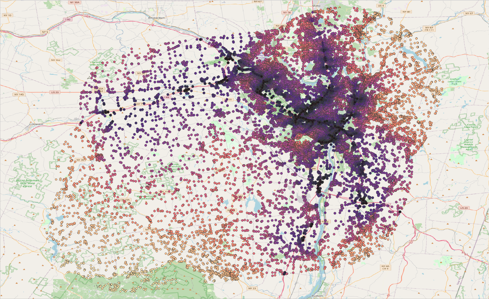
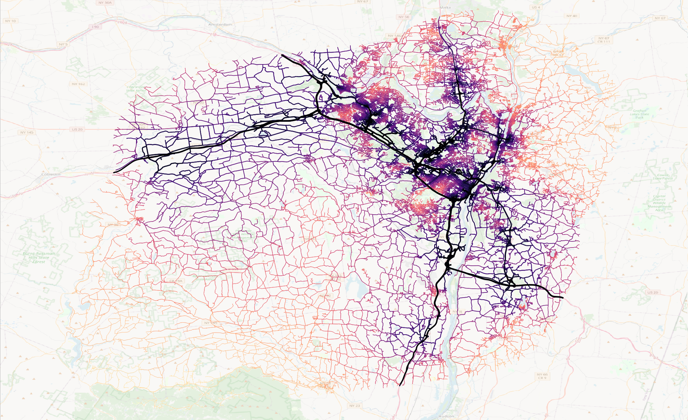
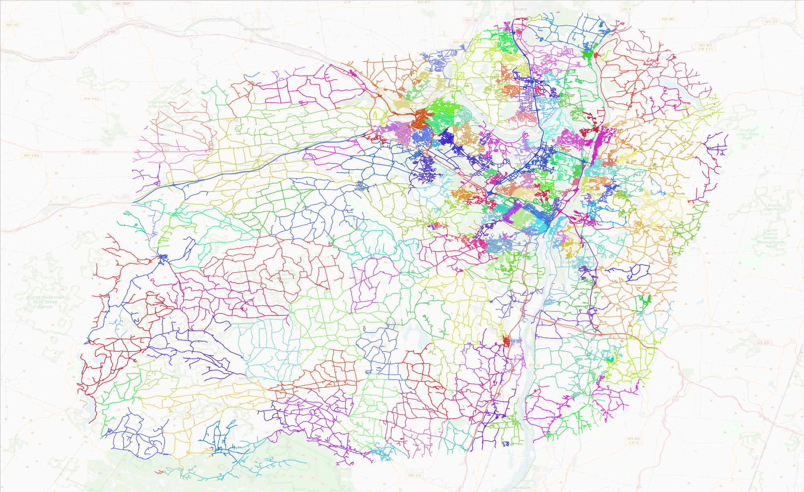

# Road Network Resilience Analysis Report

The following was generated by Google's Gemini.

## Introduction

### The Importance of Network Thinking in Road Planning

Understanding the structure and function of road networks is fundamental to geography and urban/regional planning. Treating road networks as mathematical graphs—where intersections are nodes (or vertices) and road segments are edges (or links)—allows us to apply powerful analytical techniques. Among the most useful are measures of _centrality_, which quantify the importance or influence of individual nodes or edges within the network, and methods for _community detection_, which identify clusters of highly interconnected nodes. These metrics are invaluable for assessing network efficiency, identifying vulnerabilities, and planning for resilience against disruptions[cite: 1, 4]. This section explores four key metrics: betweenness centrality (for nodes and edges), closeness centrality, and Louvain community detection.

### Purpose of this Report

This report aims to provide a comprehensive overview of how specific centrality and community detection metrics available within the NetworkX Python library can be applied to the assessment of road network resilience. Particular attention is paid to the use of weighted network analysis, where edge weights, such as travel time, are incorporated to provide a more realistic representation of network dynamics. The subsequent sections will delve into the theoretical underpinnings of these metrics, synthesize findings from relevant research, discuss limitations and alternative approaches, and highlight illustrative case studies.

## Technical Section: Network Centrality and Community Structure in Road Networks

_The above image is provided for reference before we consider different road network analysis metrics. It show the road network for Albany County plus a 10 mile buffer. The darker, thicker, roads represent interstates and trunk roads. The roads get lighter in color and thinner as they descend the road class hierarchy so that the red and yellow roads are local traffic roads._

### 1. Betweenness Centrality: Identifying Critical Crossroads and Corridors

_The above image shows the betweenness centrality of nodes (intersections) for Albany County plus a 10 mile buffer. The darker dots have higher centrality._

_The above image shows the edge betweenness centrality of edges (roadways) for Albany County plus a 10 mile buffer. The darker, thicker, lines have higher centrality._

**Conceptual Foundation:**

Betweenness centrality measures the extent to which a node (intersection) or an edge (road segment) lies on the shortest paths between other pairs of nodes in the network[cite: 2, 13].
It captures the role of a node or edge as a "bridge" or intermediary in the network's overall connectivity.
Imagine sending information or vehicles between all possible pairs of locations using the most efficient routes; betweenness centrality quantifies how often a specific intersection or road segment is part of these efficient routes.

**Calculation and Interpretation:**

- **Node Betweenness:** For a specific node _v_, its betweenness centrality is calculated by:
  1.  Finding the shortest paths between _all_ other pairs of nodes (say, node _s_ and node _t_) in the network.
  2.  Counting how many of these shortest paths pass _through_ node _v_.
  3.  Summing these counts across all possible pairs of _s_ and _t_ [cite: 13].
      (Often, this sum is normalized by dividing by the total number of pairs to get a value between 0 and 1).
- **Edge Betweenness:** The concept is analogous for edges.
  It counts how many shortest paths between all pairs of nodes run along a specific edge[cite: 17, 18].

- **Weighted Networks:** In road network analysis, "shortest path" rarely means physical distance alone.
  More realistically, it means the path with the _minimum travel time_ (or sometimes cost).
  Therefore, these calculations are typically performed on a _weighted graph_, where each edge (road segment) has a weight corresponding to its average travel time[cite: 8, 15, 19].
  This ensures that centrality reflects actual traffic flow patterns and efficiency, not just geometric distance[cite: 16].

- **Interpretation:**
  - _High Betweenness:_ A node or edge with high betweenness centrality plays a critical role in connecting different parts of the network efficiently[cite: 14].
    It handles a large proportion of the network's "through traffic." These are often major highway interchanges, critical bridges, or trunk roads.
  - _Low Betweenness:_ Nodes or edges with low betweenness are typically on more peripheral routes or local roads, primarily serving traffic originating or terminating nearby.

**Relevance to Geography, Planning, and Resilience:**

Betweenness centrality is a powerful indicator of vulnerability and importance in transportation networks.

- **Vulnerability Assessment:** Nodes and edges with high betweenness centrality represent critical points of failure[cite: 15].
  Disruption at these locations (e.g., due to accidents, construction, flooding, or seismic events) can disproportionately impact the entire network, forcing traffic onto much longer and potentially congested detours[cite: 2, 19].
  Mapping betweenness centrality highlights these vulnerabilities spatially.
- **Traffic Flow and Congestion:** High betweenness locations are naturally points where traffic converges, making them prone to congestion even during normal operations.
  Understanding this helps in traffic management and planning capacity improvements.
- **Disaster Planning & Response:** Identifying high-betweenness locations helps prioritize infrastructure hardening (e.g., seismic retrofitting of critical bridges), plan effective detour routes in advance of disruptions, and strategically position emergency response resources.
  It helps answer: "If this intersection/road is blocked, how badly is the network affected, and which areas become harder to reach?"

### 2. Closeness Centrality: Measuring Accessibility and Network Efficiency

_The above image shows the node closeness centrality of nodes (intersections) for Albany County plus a 10 mile buffer. The darker dots have higher closeness centrality._

_The above image represents closeness centrality of edges (roadways) for Albany County plus a 10 mile buffer. The darker, thicker, lines have higher closeness centrality. In this image, the edge closeness centrality was calculated by taking the minimum centrality of the edge's start and end nodes._

**Conceptual Foundation:**

Closeness centrality measures how "close" a node is to all other reachable nodes in the network, on average[cite: 24, 44].
Instead of focusing on traffic _passing through_ a location (like betweenness), it focuses on the efficiency of travel _starting from_ or _ending at_ that location.
It quantifies the accessibility of a node within the network structure.

**Calculation and Interpretation:**

- **Node Closeness:** For a specific node _v_, its closeness centrality is typically calculated as the inverse of the sum (or average) of the shortest path distances (usually measured in travel time) from _v_ to all other reachable nodes _t_ in the network[cite: 24, 35].
  A smaller total distance to all other nodes results in a higher closeness centrality score.
- **Edge Closeness:** While less standard than node closeness, edge closeness can be approximated, for instance, by considering the closeness values of the nodes it connects[cite: 23].
  An edge connecting two highly accessible nodes might itself be considered to have high closeness.

- **Weighted Networks:** As with betweenness, using travel time as the weight for calculating shortest paths is crucial for meaningful results in road networks[cite: 25, 35].
  This reflects how quickly one can actually reach other parts of the network.

- **Interpretation:**
  - _High Closeness:_ A node with high closeness centrality has short average travel times to all other destinations in the network[cite: 25].
    These locations are highly accessible and efficient points for reaching the rest of the network.
    Think of well-connected city centers or locations near major highway junctions.
  - _Low Closeness:_ Nodes with low closeness centrality are relatively peripheral or poorly connected.
    Travel from these locations to the rest of the network takes longer on average.
    These might be rural areas or neighborhoods with limited access points.

**Relevance to Geography, Planning, and Resilience:**

Closeness centrality provides insights into network accessibility and the efficiency of service provision.

- **Accessibility Analysis:** It directly measures how accessible different locations are, a key concern in urban and regional planning.
  Mapping closeness centrality can identify areas with poor access to opportunities (jobs, services) or highlight central locations well-suited for development.
- **Emergency Service Location:** Locations with high closeness centrality are potentially optimal sites for facilities that need to serve a wide area quickly, such as hospitals, fire stations, or distribution hubs for disaster relief[cite: 38].
  Their central position minimizes average response/delivery times.
- **Resilience and Equity:** During disruptions, maintaining access is critical[cite: 25, 38].
  Closeness centrality helps evaluate how network damage might impact the overall accessibility of different areas.
  For instance, if a disruption isolates an area that already has low closeness centrality, its residents might face severe difficulties accessing essential services, raising equity concerns.
  It helps answer: "How easily can one reach the rest of the network from this point, and how might disruptions affect that accessibility?"

### 3. Louvain Community Detection: Uncovering Functional Regions and Network Structure

_The above image shows the Louvain Communities of edges (roadways) for Albany County plus a 10 mile buffer. The colors were randomly assigned to the various communities._

**Conceptual Foundation:**

Community detection algorithms aim to partition a network into groups (communities) such that connections _within_ a group are dense, while connections _between_ groups are sparser[cite: 41, 43].
In road networks, these communities often correspond to geographically coherent regions, neighborhoods, or functional zones where internal travel is more common or efficient than travel between zones.
The Louvain method is a popular and efficient algorithm for finding these structures in large networks[cite: 41, 44].

**Calculation and Interpretation:**

- **The Louvain Method:** It works iteratively to optimize a metric called _modularity_.
  Modularity measures the quality of a network partition into communities – it compares the density of links within communities to the density one would expect if links were placed randomly.
  The algorithm proceeds in phases:

  1.  Initially, each node is its own community.
  2.  Nodes are iteratively moved to neighboring communities if the move increases the overall modularity[cite: 28, 41].
      This is repeated until no single move can improve modularity.
  3.  The identified communities are then aggregated into "super-nodes," and the process (steps 1 & 2) is repeated on this new, smaller network[cite: 28].
      This hierarchical aggregation continues until modularity cannot be increased further[cite: 29, 41].

- **Weighted Networks:** The Louvain algorithm readily incorporates edge weights[cite: 29, 41].
  In road networks, using travel time as a weight means the algorithm groups nodes (intersections) such that travel _within_ a community is generally efficient, reflecting actual travel patterns and functional connectivity[cite: 41].

- **Interpretation:** The output is a partition of the network's nodes (and associated edges) into distinct communities[cite: 27].
  Nodes within the same community are more strongly connected to each other (in terms of travel time or traffic flow) than they are to nodes in other communities.
  These communities often align with geographical features, administrative boundaries, or distinct functional areas (e.g., downtown, residential suburbs, industrial parks).

**Relevance to Geography, Planning, and Resilience:**

Community detection reveals the mesoscale structure of the road network, offering valuable insights for planning and resilience.

- **Understanding Functional Regions:** It helps identify functionally related areas based on transportation patterns, going beyond simple administrative boundaries.
  This informs regional planning, traffic modeling, and understanding commuting patterns.
- **Impact Propagation:** Disruptions may propagate differently depending on the network's community structure[cite: 30, 46].
  A failure _within_ a community might primarily affect local travel in that zone.
  However, the failure of a critical "bridge" edge _connecting_ two communities can have much wider repercussions, potentially isolating entire communities or severing major flows between functional regions[cite: 30].
- **Hierarchical Planning:** The hierarchical nature of the Louvain method can reveal structure at different scales (local neighborhoods, larger districts), which can be useful for multi-level planning.
- **Resilience Strategies:** Knowing the community structure helps tailor resilience strategies.
  For instance, ensuring redundant connections exist _between_ key communities might be a priority.
  Evacuation or relief distribution plans can be structured around these identified communities.
  It helps answer: "What are the main functional zones in this network, and how strongly are they connected or separated?"

By applying these metrics—betweenness, closeness, and community detection—using realistic travel time weights, geographers and planners can gain a deeper, quantitative understanding of road network structure, function, accessibility, and vulnerability.
This knowledge is essential for effective transportation planning, infrastructure investment, and building more resilient systems capable of withstanding and recovering from disruptions[cite: 1, 4, 55].

## Software and Implementation

The metrics discussed are implemented using the NetworkX Python library, which provides efficient algorithms for network analysis. The analysis of road networks often involves the use of OpenStreetMap (OSM) data, which can be processed and converted into NetworkX graphs using libraries like OSMnx 6.

## Data Dictionary

| **Name**                      | **Type**   | **Description**                                    | **Calculation**                                                    |
| :---------------------------- | :--------- | :------------------------------------------------- | :----------------------------------------------------------------- |
| fid                           | INTEGER    | Unique feature ID (primary key)                    | N/A                                                                |
| geom                          | LINESTRING | Geometry of the road segment                       | OSMnx                                                              |
| u                             | INTEGER    | Start node ID of the road segment                  | OSMnx                                                              |
| v                             | INTEGER    | End node ID of the road segment                    | OSMnx                                                              |
| key                           | INTEGER    | Key of the edge in the MultiDiGraph                | OSMnx                                                              |
| node_betweenness_centrality_u | REAL       | Node betweenness centrality for the start node (u) | networkx.betweenness_centrality(G, weight='travel_time') 8         |
| node_betweenness_centrality_v | REAL       | Node betweenness centrality for the end node (v)   | networkx.betweenness_centrality(G, weight='travel_time') 8         |
| edge_betweenness_centrality   | REAL       | Edge betweenness centrality of the road segment    | networkx.edge_betweenness_centrality(G, weight='travel_time') 9    |
| closeness_centrality_u        | REAL       | Closeness centrality for the start node (u)        | networkx.closeness_centrality(G) 35                                |
| closeness_centrality_v        | REAL       | Closeness centrality for the end node (v)          | networkx.closeness_centrality(G) 35                                |
| louvain_community_u           | INTEGER    | Louvain community ID for the start node (u)        | networkx.community.louvain_communities(G, weight='travel_time') 41 |
| louvain_community_v           | INTEGER    | Louvain community ID for the end node (v)          | networkx.community.louvain_communities(G, weight='travel_time') 41 |

## 6. References

1.  A New Approach to Assessing Transport Network Resilience - MDPI, accessed April 8, 2025, https\://[www.mdpi.com/2413-8851/9/2/35](https://www.mdpi.com/2413-8851/9/2/35)
2.  Full article: Disaster vulnerability in road networks: a data-driven approach through analyzing network topology and movement activity, accessed April 8, 2025, https\://[www.tandfonline.com/doi/full/10.1080/13658816.2024.2411001](https://www.tandfonline.com/doi/full/10.1080/13658816.2024.2411001)
3.  Resilience Assessment of Transportation Networks Considering Augmented Links and External Disturbances. [www.mdpi.com](https://www.mdpi.com).
4.  Resilience of transportation infrastructure networks to road failures | Chaos - AIP Publishing, accessed April 8, 2025, https://pubs.aip.org/aip/cha/article/34/1/013124/3037471/Resilience-of-transportation-infrastructure
5.  A topology-based evaluation of resilience on urban road networks against epidemic spread: Implications for COVID-19 responses - Frontiers, accessed April 8, 2025, https\://www.frontiersin.org/journals/public-health/articles/10.3389/fpubh.2022.1023176/full
6.  Working with spatial networks using NetworkX | D-Lab, accessed April 8, 2025, https://dlab.berkeley.edu/news/working-spatial-networks-using-networkx
7.  Navigating Networks with NetworkX: A Short Guide to Graphs in Python - Medium, accessed April 8, 2025, https://[medium.com/data-science/navigating-networks-with-networkx-a-short-guide-to-graphs-in-python-c16cbafe8063](https://medium.com/data-science/navigating-networks-with-networkx-a-short-guide-to-graphs-in-python-c16cbafe8063)
8.  between_centrality - NetworkX 3.4.2 documentation, accessed April 8, 2025, https://networkx.org/documentation/stable/reference/algorithms/generated/networkx.algorithms.centrality.betweenness\_centrality.html
9.  edge_betweenness_centrality - NetworkX 3.4.2 documentation, accessed April 8, 2025, https://networkx.org/documentation/stable/reference/algorithms/generated/networkx.algorithms.centrality.edge\_betweenness\_centrality.html
10. Edge-based graph neural network for ranking critical road segments in a network - PMC, accessed April 8, 2025, https://pmc.ncbi.nlm.nih.gov/articles/PMC10734987/
11. Road Network Resilience: How to Identify Critical Links Subject to Day-to-Day Disruptions | Request PDF - ResearchGate, accessed April 8, 2025, https://www.researchgate.net/publication/327320732\_Road\_Network\_Resilience\_How\_to\_Identify\_Critical\_Links\_Subject\_to\_Day-to-Day\_Disruptions
12. Networkx never finishes calculating Betweenness centrality for 2 mil nodes - Stack Overflow, accessed April 8, 2025, https://[stackoverflow.com/questions/32465503/networkx-never-finishes-calculating-betweenness-centrality-for-2-mil-nodes](https://stackoverflow.com/questions/32465503/networkx-never-finishes-calculating-betweenness-centrality-for-2-mil-nodes)
13. thesis towards interactive betweenness centrality estimation for transportation network using capsule - Mountain Scholar, accessed April 8, 2025, https://mountainscholar.org/bitstreams/9b296c78-3349-4ed3-8191-879f9dd19358/download
14. Accelerating NetworkX on NVIDIA GPUs for High Performance Graph Analytics, accessed April 8, 2025, https://[developer.nvidia.com/blog/accelerating-networkx-on-nvidia-gpus-for-high-performance-graph-analytics/](https://developer.nvidia.com/blog/accelerating-networkx-on-nvidia-gpus-for-high-performance-graph-analytics/)
15. NetworkX Introduces Zero Code Change Acceleration Using NVIDIA cuGraph, accessed April 8, 2025, https://[developer.nvidia.com/blog/networkx-introduces-zero-code-change-acceleration-using-nvidia-cugraph/](https://developer.nvidia.com/blog/networkx-introduces-zero-code-change-acceleration-using-nvidia-cugraph/)
16. Centrality Measures in Network Robustness - University of Notre Dame, accessed April 8, 2025, https://www3.nd.edu/\~kogge/courses/cse60742-Fall2018/Public/StudentWork/KernelPaperFinal/betweenness3\_FT.pdf
17. ROBUSTNESS OF ROAD NETWORK FOR ASSESSING THE RESILIENCE OF THE NETWORK - RUN, accessed April 8, 2025, https://run.unl.pt/bitstream/10362/67709/1/TGEO0201.pdf
18. A Faster Algorithm for Betweenness Centrality - ResearchGate, accessed April 8, 2025, https://www.researchgate.net/publication/2887625\_A\_Faster\_Algorithm\_for\_Betweenness\_Centrality
19. How to add edge length as a weight in betweeness centrality using OSMnx/Networkx?, accessed April 8, 2025, https://[stackoverflow.com/questions/56028683/how-to-add-edge-length-as-a-weight-in-betweenness-centrality-using-osmnx-networkx](https://stackoverflow.com/questions/56028683/how-to-add-edge-length-as-a-weight-in-betweeness-centrality-using-osmnx-networkx)
20. A faster algorithm for betweenness centrality - Loyola Marymount University, accessed April 8, 2025, https://[lmu.primo.exlibrisgroup.com/discovery/fulldisplay?docid=cdi](https://lmu.primo.exlibrisgroup.com/discovery/fulldisplay?docid=cdi)\_informaworld_taylorfrancis_310_1080_0022250X_2001_9990249&context=PC&vid=01LMUINST:01LMU&lang=en&search_scope=Mylnst_and_Cl\&adaptor=Primo%20Central\&query=null%2C%2CCases\&facet=citing\%2Cexact\%2Ccdi_FETCH-LOGICAL-c372t-5cfc5bdd2361666776e23b05487f5c99238e1e888fb4a90c0f81df1bbe810af83\&offset=50
21. A Faster Algorithm for Betweenness Centrality - KOPS, accessed April 8, 2025, https://kops.uni-konstanz.de/urn/urn:nbn:de:bsz:352-opus-71888
22. \[PDF] A faster algorithm for betweenness centrality - Semantic Scholar, accessed April 8, 2025, https://www.semanticscholar.org/paper/A-Faster-Algorithm-for-Betweenness-Centrality-Brandes/1ef8c8c815b7268d7f7d4fe76af78aaa8df3e6da
23. A Faster Algorithm for Betweenness Centrality - Stanford Network Analysis Project, accessed April 8, 2025, http://snap.stanford.edu/class/cs224w-readings/brandes01centrality.pdf
24. A faster algorithm for betweenness centrality\*: The Journal of Mathematical Sociology, accessed April 8, 2025, https://[www.tandfonline.com/doi/abs/10.1080/0022250X.2001.9990249](https://www.tandfonline.com/doi/abs/10.1080/0022250X.2001.9990249)
25. A Faster Algorithm for Betweenness Centrality, accessed April 8, 2025, https://jshun.csail.mit.edu/6886-s21/lectures/lecture3-2.pdf
26. Paper by Ulrik Brandes, University of Konstanz Brief 6.886 Presentation by Taylor Andrews Tuesday, February 12th 2019 - MIT, accessed April 8, 2025, https://jshun.csail.mit.edu/6886-s19/lectures/lecture3-2.pdf
27. A faster algorithm for betweenness centrality - Research Collection, accessed April 8, 2025, https://www.research-collection.ethz.ch/handle/20.500.11850/411690
28. Betweenness Centrality :: Graph Data Science Library - TigerGraph Documentation, accessed April 8, 2025, https://[docs.tigergraph.com/graph-ml/3.10/centrality-algorithms/betweenness-centrality](https://docs.tigergraph.com/graph-ml/3.10/centrality-algorithms/betweenness-centrality)
29. Brandes, U. (2001) A Faster Algorithm for Betweenness Centrality. Journal of Mathematical Sociology, 25, 163-177. - References - Scientific Research Publishing, accessed April 8, 2025, https://www.scirp.org/reference/referencespapers?referenceid=1581674
30. (PDF) A Faster Algorithm to Update Betweenness Centrality After Node Alteration, accessed April 8, 2025, https://www.researchgate.net/publication/258546733_A_Faster_Algorithm_to_Update_Betweenness_Centrality_After_Node_Alteration
31. Using Graph Model to Analyze the Topological Vulnerability of Transport Infrastructure - CEUR-WS, accessed April 8, 2025, https://ceur-ws.org/Vol-1623/papertl1.pdf
32. -i- A Study on Identifying Road Network Vulnerability By JONGHEE LIM THESIS Submitted in partial satisfaction of the requirement - eScholarship.org, accessed April 8, 2025, https://escholarship.org/content/qt9gx5v4d9/qt9gx5v4d9_noSplash_6f7913e7bc2ec9e4882fe5c010dea364.pdf?t=r23fnd
33. Edge betweenness centrality in road networks before and after extreme... - ResearchGate, accessed April 8, 2025, https://www.researchgate.net/figure/Edge-betweenness-centrality-in-road-networks-before-and-after-extreme-flood-a-New-York_fig1_310515593
34. Edge Betweenness Centrality - python - Stack Overflow, accessed April 8, 2025, https://[stackoverflow.com/questions/69528426/edge-betweenness-centrality](https://stackoverflow.com/questions/69528426/edge-betweenness-centrality)
35. closeness_centrality - NetworkX 3.4.2 documentation, accessed April 8, 2025, https://networkx.org/documentation/stable/reference/algorithms/generated/networkx.algorithms.centrality.closeness_centrality.html
36. networkx.algorithms.centrality.closeness_centrality - NetworkX 2.2 documentation, accessed April 8, 2025, https://networkx.org/documentation/networkx-2.2/reference/algorithms/generated/networkx.algorithms.centrality.closeness_centrality.html
37. Network Centrality: Understanding Degree, Closeness & Betweenness Centrality, accessed April 8, 2025, https://[visiblenetworklabs.com/2021/04/16/understanding-network-centrality/](https://visiblenetworklabs.com/2021/04/16/understanding-network-centrality/)
38. NETWORK CENTRALITY ASSESSMENT (NCA): ASSESSING THE TRANSPORT NETWORK RESILIENCE TO URBAN FLOODING - Semantic Scholar, accessed April 8, 2025, https://pdfs.semanticscholar.org/63f9/683cc90c28d55c75ffdb164e736a9126b2c2.pdf
39. Interconnectedness enhances network resilience of multimodal public transportation systems for Safe-to-Fail urban mobility - PubMed Central, accessed April 8, 2025, https://pmc.ncbi.nlm.nih.gov/articles/PMC10354098/
40. Modeling and Graph Analysis for Enhancing Resilience in Smart Homes - John Symons, accessed April 8, 2025, http://www.johnsymons.net/wp-content/uploads/2012/04/EUSPN-48_7875.pdf
41. louvain_communities - NetworkX 3.4.2 documentation, accessed April 8, 2025, https://networkx.org/documentation/stable/reference/algorithms/generated/networkx.algorithms.community.louvain_communities.html
42. louvain_partitions - NetworkX 3.4.2 documentation, accessed April 8, 2025, https://networkx.org/documentation/stable/reference/algorithms/generated/networkx.algorithms.community.louvain.louvain_partitions.html
43. Communities - NetworkX 3.4.2 documentation, accessed April 8, 2025, https://networkx.org/documentation/stable/reference/algorithms/community.html
44. Louvain method - Wikipedia, accessed April 8, 2025, <https://en.wikipedia.org/wiki/Louvain>\_method
45. Network, correlation, and community structure of the financial sector of Bursa Malaysia before, during, and after COVID-19 - AIMS Press, accessed April 8, 2025, https://[www.aimspress.com/article/doi/10.3934/DSFE.2024016](https://www.aimspress.com/article/doi/10.3934/DSFE.2024016)
46. Community Structure and Resilience of the City Logistics Networks in China - MDPI, accessed April 8, 2025, https://[www.mdpi.com/2227-7390/11/20/4352](https://www.mdpi.com/2227-7390/11/20/4352)
47. Detecting Malicious Access Using the Louvain Community Detection Algorithm - Silverfort, accessed April 8, 2025, https://[www.silverfort.com/blog/detecting-and-predicting-malicious-access-in-enterprise-networks-using-the-louvain-community-detection-algorithm/](https://www.silverfort.com/blog/detecting-and-predicting-malicious-access-in-enterprise-networks-using-the-louvain-community-detection-algorithm/)
48. Evolution of Disruption Resilience in the Wood Forest Products Trade Network, Considering the Propagation of Disruption Risks and Underload Cascading Failure - MDPI, accessed April 8, 2025, https://[www.mdpi.com/2071-1050/17/6/2733](https://www.mdpi.com/2071-1050/17/6/2733)
49. Complex network community discovery using fast local move iterated greedy algorithm - arXiv, accessed April 8, 2025, https://arxiv.org/pdf/2406.14751
50. Complex network community discovery using fast local move iterated greedy algorithm, accessed April 8, 2025, https://arxiv.org/html/2406.14751v1
51. Memory-Efficient Community Detection on Large Graphs Using Weighted Sketches - arXiv, accessed April 8, 2025, https://arxiv.org/html/2411.02268v2
52. Graph-based ahead monitoring of vulnerabilities in large dynamic transportation networks - PMC - PubMed Central, accessed April 8, 2025, https://pmc.ncbi.nlm.nih.gov/articles/PMC7990197/
53. (PDF) Fast unfolding of communities in large networks (2008) | Vincent D. Blondel | 11078 Citations - SciSpace, accessed April 8, 2025, https://[scispace.com/papers/fast-unfolding-of-communities-in-large-networks-3hz1lz8b9n](https://scispace.com/papers/fast-unfolding-of-communities-in-large-networks-3hz1lz8b9n)
54. Fast unfolding of communities in large networks - NIH Library Collection Search, accessed April 8, 2025, https://onesearch.nihlibrary.ors.nih.gov/discovery/fulldisplay?docid=cdi_iop_primary_10_1088_1742_5468_2008_10_P10008&context=PC&vid=01NIHINST:NIH&lang=en&adaptor=Primo%20Central&tab=NIHCampus&query=sub%2Cequals%2CAnatomy,\_Comparative\_-\_methods___AND&facet=citing%2Cexact%2Ccdi_FETCH-LOGICAL-c521t-14dc874483d346869cfdd2618806aa42de3fbda543fde7973ff78f23&offset=30
55. Fast unfolding of communities in large networks - SciSpace, accessed April 8, 2025, https://[scispace.com/pdf/fast-unfolding-of-communities-in-large-networks-3hz1lz8b9n.pdf](https://scispace.com/pdf/fast-unfolding-of-communities-in-large-networks-3hz1lz8b9n.pdf)
56. (PDF) Fast Unfolding of Communities in Large Networks - ResearchGate, accessed April 8, 2025, https://www.researchgate.net/publication/1913681_Fast_Unfolding_of_Communities_in_Large_Networks
57. Fast unfolding of communities in large networks - Complex Networks, accessed April 8, 2025, https://www.complexnetworks.fr/fast-unfolding-of-communities-in-large-networks/
58. \[0803.0476\] Fast unfolding of communities in large networks - arXiv, accessed April 8, 2025, <https://arxiv.org/abs/0803.0476>
59. Fast unfolding of community hierarchies in large networks - ResearchGate, accessed April 8, 2025, https://www.researchgate.net/publication/220485842_Fast_unfolding_of_community_hierarchies_in_large_networks
60. Fast unfolding of communities in large networks - NASA ADS, accessed April 8, 2025, <https://ui.adsabs.harvard.edu/abs/2008JSMTE..10..008B/abstract>
61. \[2311.06047\] Fast unfolding of communities in large networks: 15 years later - arXiv, accessed April 8, 2025, <https://arxiv.org/abs/2311.06047>
62. Fast unfolding of community hierarchies in large networks - dblp, accessed April 8, 2025, <https://dblp.org/rec/journals/corr/abs-0803-0476>
63. Fast unfolding of communities in large networks - TCS Education System Libraries, accessed April 8, 2025, https://search.tcsedsystem.edu/discovery/fulldisplay?docid=cdi_unpaywall_primary_10_1088_1742_5468_2008_10_P10008&context=PC&vid=01TCSEDSYSTEMINST:KSCOM&lang=en&search_scope=KSCOM_and_Cl&adaptor=Primo%20Central&query=sub%2Cexact%2C49%2F47___AND&facet=citing%2Cexact%2Ccdi_FETCH-LOGICAL-c495t-40b683d947dbf9059c61317b1867070807f8dd4760137ab0ad64d43373b1f1bc3&offset=40
64. Fast unfolding of communities in large networks - City University of Hong Kong (Dongguan), accessed April 8, 2025, https://cityu-dg.primo.exlibrisgroup.com.cn/discovery/fulldisplay?docid=cdi_iop_primary_10_1088_1742_5468_2008_10_P10008&context=PC&vid=86CITYU_DG:cityu_dg&lang=en&search_scope=MyInst_and_Cl&adaptor=Primo%20Central&query=creator%2Cequals%2CFelber%2C%20Barbara%20K%20%2CAND&facet=citing%2Cexact%2Ccdi_FETCH-LOGICAL-c437t-a9547c372335c83a0e8e92a63f9aa4851068a146414b4108825c9d41330383253&offset=40
65. Fast unfolding of communities in large networks - Université catholique de Louvain, accessed April 8, 2025, https://perso.uclouvain.be/vincent.blondel/publications/08BG.pdf
66. Fast unfolding of communities in large networks (Journal Article) | ETDEWEB-OSTI.GOV, accessed April 8, 2025, https://www.osti.gov/etdeweb/biblio/22152901
67. Transportation Networks in the Face of Climate Change Adaptation..., accessed April 8, 2025, https://[www.mdpi.com/2673-7590/3/3/49](https://www.mdpi.com/2673-7590/3/3/49)
68. Urban Road Network Resilience Metrics and their Relationship: Some Experimental Findings | Request PDF - ResearchGate, accessed April 8, 2025, https://www.researchgate.net/publication/364628046_Urban_Road_Network_Resilience_Metrics_and_their_Relationship_Some_Experimental_Findings
69. Full article: Assessing road network resilience and vulnerability in urban transport systems against urban flooding - Taylor & Francis Online, accessed April 8, 2025, https://[www.tandfonline.com/doi/full/10.1080/17477891.2025.2469634?src=exp-la](https://www.tandfonline.com/doi/full/10.1080/17477891.2025.2469634?src=exp-la)
70. Assessing transport network resilience: empirical insights from real-world data studies, accessed April 8, 2025, https://[www.tandfonline.com/doi/full/10.1080/01441647.2024.2322434](https://www.tandfonline.com/doi/full/10.1080/01441647.2024.2322434)
71. Resilience Analysis of Traffic Network under Emergencies: A Case Study of Bus Transit Network - MDPI, accessed April 8, 2025, https://[www.mdpi.com/2076-3417/13/15/8835](https://www.mdpi.com/2076-3417/13/15/8835)
72. A Quantitative Approach for Assessment and Improvement of Network Resilience - University of Houston, accessed April 8, 2025, https://www.ie.uh.edu/sites/ie/files/faculty/glim/REES_resilience.pdf
73. Four metrics for understanding the resilience of road networks. The... - ResearchGate, accessed April 8, 2025, [https://www.researchgate.net/figure/Four-metrics-for-understanding-the-resilience-of-road-networks-The-quantitative-and](https://www.google.com/search?q=https://www.researchgate.net/figure/Four-metrics-for-understanding-the-resilience-of-road-networks-The-quantitative-and)\_fig1_360410505
74. Resilience and efficiency in transportation networks - PMC - PubMed Central, accessed April 8, 2025, https://pmc.ncbi.nlm.nih.gov/articles/PMC5744464/
75. Dynamic Evaluation of Road Network Resilience to Traffic Accidents: An Emergency Management Perspective for Sustainable Cities in China - MDPI, accessed April 8, 2025, <https://www.mdpi.com/2071-1050/16/17/7385>
76. Resilience in road networks - ITS Edulab, accessed April 8, 2025, https://www.its-edulab.nl/reports/resilience-in-road-networks/
77. Resilience in road networks - TU Delft Repository, accessed April 8, 2025, <https://repository.tudelft.nl/record/uuid:f48964ab-07f8-4816-b1cd-a6b2c51e17f0>
78. Resilience in road networks, accessed April 8, 2025, <https://www.victorknoop.eu/research/theses/Resilience>\_in_road_networks_Baert.pdf
79. Empirical assessment of road network resilience in natural hazards using crowdsourced traffic data - COMPASS Lab, accessed April 8, 2025, https://www.compasslab.info/pubs/ijgis_2020.pdf
80. Resilience Assessment of Urban Road Transportation in Rainfall - MDPI, accessed April 8, 2025, <https://www.mdpi.com/2072-4292/16/17/3311>
81. Data-Driven Methods to Assess Transportation System Resilience in Arkansas ROSA P, accessed April 8, 2025, <https://rosap.ntl.bts.gov/view/dot/75150/dot_75150_DS1.pdf>
82. MEASURING URBAN ROAD NETWORK RESILIENCE TO EXTREME EVENTS - arXiv, accessed April 8, 2025, <https://arxiv.org/pdf/1912.01739>
83. Transportation Network Resilience: Evaluation of Performance Measures - ScholarWorks@UTEP, accessed April 8, 2025, <https://scholarworks.utep.edu/cgi/viewcontent.cgi?article=1903&context=open_etd>
84. Complex Networks Perspectives towards Accelerated Bridge Construction (ABC), accessed April 8, 2025, <https://abc-utc.fiu.edu/wp-content/uploads/2020/06/Progress>\_Report-ABC-UTC-2016-C2-FIUO8_June-2020_Final.pdf
85. Edge-based graph neural network for ranking critical road segments in a network PLOS, accessed April 8, 2025, <https://journals.plos.org/plosone/article?id=10.1371/journal.pone.0296045>
86. Resilience metrics for transport networks: A review and practical examples for bridges, accessed April 8, 2025, <https://www.researchgate.net/publication/357196353_Resilience_metrics_for_transport_networks_A_review_and_practical_examples_for_bridges>
87. A Survey on Centrality Metrics and Their Network Resilience Analysis ResearchGate, accessed April 8, 2025, <https://www.researchgate.net/publication/352939385_A_Survey_on_Centrality_Metrics_and_Their_Network_Resilience_Analysis>
88. (PDF) Analysis of network resilience global air transportation - ResearchGate, accessed April 8, 2025, https://www.researchgate.net/publication/372203236_Analysis_of_network_resilienceon_global_air_transportation
89. Complex Network Series: Part 5 - Community Detection and Subgraphs - Medium, accessed April 8, 2025, https://[medium.com/@ebimsv/complex-network-series-part-5-community-detection-and-subgraphs-4198eb035b8b](https://medium.com/@ebimsv/complex-network-series-part-5-community-detection-and-subgraphs-4198eb035b8b)
90. Community detection for NetworkX's documentation - Community detection for NetworkX 2 documentation, accessed April 8, 2025, <https://python-louvain.readthedocs.io/>
91. \[2412.15865\] Understanding the Structure and Resilience of the Brazilian Federal Road Network Through Network Science - arXiv, accessed April 8, 2025, <https://arxiv.org/abs/2412.15865>
92. From slope seismic resilience to regional road network resilience: an integrated framework for evaluating the seismic resilience of mountainous road networks - OAE Publishing Inc., accessed April 8, 2025, https://[www.oaepublish.com/articles/dpr.2023.27](https://www.oaepublish.com/articles/dpr.2023.27)
93. Evaluating and Predicting Road Network Resilience Using Traffic Speed and Log Data, accessed April 8, 2025, https://ascelibrary.org/doi/10.1061/9780784484265.198
94. Why are nodes with a high betweenness centrality score high maintenance? - Reddit, accessed April 8, 2025, [https://www.reddit.com/r/algorithms/comments/113nz2o/why](https://www.google.com/search?q=https://www.reddit.com/r/algorithms/comments/113nz2o/why)\_are_nodes_with_a_high_betweenness_centrality/
95. Linton C. Freeman - the Academic Senate - University of California, accessed April 8, 2025, <https://senate.universityofcalifornia.edu/in-memoriam/files/linton-freeman.html>
96. Linton C. Freeman PhD Professor at University of California, Irvine - ResearchGate, accessed April 8, 2025, <https://www.researchgate.net/profile/Linton-Freeman-2>
97. Freeman, L.C. (1979) Centrality in Social Networks Conceptual Clarification. Social Networks, 1, 215-239. - References - Scientific Research Publishing, accessed April 8, 2025, <https://www.scirp.org/reference/referencespapers?referenceid=1448578>
98. Centrality in social networks conceptual clarification - Science Open, accessed April 8, 2025, <https://www.scienceopen.com/document?vid=f64d8c9d-fdfa-487d-95ad-1668e5adc0ef>
99. Centrality in Social Networks Conceptual Clarification | MILES - Idaho's ecosystem services, accessed April 8, 2025, <https://www.idahoecosystems.org/centrality-social-networks-conceptual-clarification>
100.  Linton C Freeman - Google Scholar, accessed April 8, 2025, <https://scholar.google.com/citations?user=quiVMg8AAAAJ>&hl=en
101.  Centrality in social networks I. Conceptual clarification - ProQuest, accessed April 8, 2025, <https://www.proquest.com/docview/1294819894>
102.  Centrality in social networks conceptual clarification - Semantic Scholar, accessed April 8, 2025, <https://www.semanticscholar.org/paper/Centrality-in-social-networks-conceptual-Freeman/5d61ef638fd684facc1e68e654053e9bc065b36f>
103.  Linton C Freeman - Google Scholar, accessed April 8, 2025, [https://scholar.google.fr/citations?user=quiVMg8AAAAJ](https://www.google.com/search?q=https://scholar.google.fr/citations%3Fuser%3DquiVMg8AAAAJ)&hl=th
104.  Linton C Freeman - Google Scholar, accessed April 8, 2025, <https://scholar.google.com/citations?user=quiVMg8AAAAJ>&hl=vi
105.  A Set of Measures of Centrality Based on Betweenness - Bellevue University, accessed April 8, 2025, [https://bellevue.primo.exlibrisgroup.com/discovery/fulldisplay?docid=cdi](https://www.google.com/search?q=https://bellevue.primo.exlibrisgroup.com/discovery/fulldisplay%3Fdocid%3Dcdi)\_proquest_journals_1297089201&context=PC&vid=01BUNINST:01BUN&lang=en&search_scope=Mylnst_and_Cl&adaptor=Primo%20Central&query=null%2C%2C276%2CAND&facet=citing%2Cexact%2Ccdi_FETCH-LOGICAL-c375t-353619bd1a42a7ceb9c847a81202dd89bc7a08f50384b4009f5ce86e679844573&offset=30
106.  A Set of Measures of Centrality Based on Betweenness - ResearchGate, accessed April 8, 2025, <https://www.researchgate.net/publication/216637282_A_Set_of_Measures_of_Centrality_Based_on_Betweenness>
107.  A Set of Measures of Centrality Based on Betweenness - Florida Atlantic University Libraries, accessed April 8, 2025, [https://fau-flvc.primo.exlibrisgroup.com/discovery/fulldisplay?docid=cdi](https://www.google.com/search?q=https://fau-flvc.primo.exlibrisgroup.com/discovery/fulldisplay%3Fdocid%3Dcdi)\_proquest_journals_1297089201&context=PC&vid=01FALSC_FAU:FAU&lang=en&search_scope=Mylnst_and_Cl&adaptor=Primo%20Central&query=null%2C%2C253&facet=citing%2Cexact%2Ccdi_FETCH-LOGICAL-c416t-6d9d55a6cfd5900ea3dfb6c76cf95485f0f82e026a04f2d0d75f307fabea2b0b3&offset=40
108.  A Set of Measures of Centrality Based On Betweenness | PDF | Pi | Graph Theory - Scribd, accessed April 8, 2025, <https://www.scribd.com/document/580201172/A-Set-of-Measures-of-Centrality-Based-on-Betweenness>
109.  A Set of Measures of Centrality Based on Betweenness | BibSonomy, accessed April 8, 2025, <https://www.bibsonomy.org/bibtex/7ff13dc1fa197ed99dadeb6e23cf070b>
110.  A Set of Measures of Centrality Based on Betweenness - ScienceOpen, accessed April 8, 2025, <https://www.scienceopen.com/document?vid=5ccaa90e-9498-41d0-8cd0-d55693133946>
111.  A Set of Measures of Centrality Based on Betweenness - Northwestern University, accessed April 8, 2025, <https://search.library.northwestern.edu/discovery/openurl?institution=01NWU>\_INST&rfr_id=info:sid%252Fprimo.exlibrisgroup.com-bX-Bx&rft_val_fmt=info:ofi/fmt:kev:mtx:&rft.epage=41&rft.volume=40&rft_id=info:doi/&rfr_id=info:sid/[primo.exlibrisgroup.com](https://www.google.com/search?q=primo.exlibrisgroup.com)-1059263-Bx&resource_type=article&rft.isbn_list=&rft.jtitle=Sociometry&rft.genre=article&rft.issue=1&rft.auinit1=L&rft.aulast=Freeman&rft.auinit=LC&rft.date=1977&rft.eisbn_list=&rft.spage=35&rft.au=Freeman, %20Linton%20C%20C&rft.atitle=A%20Set%20of%20Measures%20of%20Centrality%20Based%20on%20Betweenness&rft.issn=0038-0431&rft.eissn=2325-7938&svc_dat=CTO&vid=01NWU_INST:NULVNEW&lang=en

112.  Freeman, L.C. (1977) A Set of Measures of Centrality Based on Betweenness. Sociometry, 40, 35-41. - References - Scientific Research Publishing, accessed April 8, 2025, <https://www.scirp.org/reference/referencespapers?referenceid=1435451>

113.  Why the normalization constant of betweenness centrality is $(N-1)(N-2)/2,$ ? - Mathematics Stack Exchange, accessed April 8, 2025, <https://math.stackexchange.com/questions/4602340/why-the-normalization-constant-of-betweenness-centrality-is-n-1n-2-2>

114.  A Faster Algorithm for Betweenness Centrality Based on Adjacency Matrices - NASA ADS, accessed April 8, 2025, <https://ui.adsabs.harvard.edu/abs/arXiv:2205.00162>

115.  Freeman, L.C. (1978) Centrality in Social Networks Conceptual Clarification. Social Networks, 1, 215-239. - References - Scientific Research Publishing, accessed April 8, 2025, <https://www.scirp.org/reference/referencespapers?referenceid=2251215>

116.  A Set of Measures of Centrality Based on Betweenness - University of Manchester, accessed April 8, 2025, [https://www.librarysearch.manchester.ac.uk/discovery/fulldisplay?docid=cdi](https://www.google.com/search?q=https://www.librarysearch.manchester.ac.uk/discovery/fulldisplay%3Fdocid%3Dcdi)\_proquest_journals_1297089201&context=PC&vid=44MAN_INST:MU_NUI&lang=en&search_scope=MyInst_and_Cl&adaptor=Primo%20Central&query=creator%2Cexact%2C%20Dubchak%2C%20Inna%20%2CAND&facet=citing%2Cexact%2Ccdi_FETCH-LOGICAL-b618t-bec1a7bbe2cf3d44e5656c780ca3e4e3473cd6335b4b7c498e792fea7ce2d6473&offset=50

117.  A Set of Measures of Centrality Based on Betweenness - Loyola Marymount University, accessed April 8, 2025, <https://lmu.primo.exlibrisgroup.com/discovery/fulldisplay?docid=cdi>\_proquest_journals_1297089201&context=PC&vid=01LMU_INST:01LMU\&lang=en\&search_scope=Mylnst_and_Cl\&adaptor=Primo%20Central\&query=null\%2C\%2CCases\&facet=citing\%2Cexact\%2Ccdi_FETCH-LOGICAL-c337t-6f90391e67c7b13380f5173ed812417a8d8960303541964d04c37ffab825c7833\&offset=160

118.  Centrality in Valued Graphs: A Measure of Betweenness Based on Network Flow, accessed April 8, 2025, <https://www.researchgate.net/publication/222865734>\_Centrality_in_Valued_Graphs_A_Measure_of_Betweenness_Based_on_Network_Flow

119.  Betweenness Centrality - Analytics & Algorithms - Ultipa Graph, accessed April 8, 2025, <https://www.ultipa.com/document/ultipa-graph-analytics-algorithms/betweenness-centrality/v4.5>

120.  (PDF) Centrality in Network of Urban Streets - ResearchGate, accessed April 8, 2025, <https://www.researchgate.net/publication/7179558>\_Centrality_in_Network_of_Urban_Streets

121.  A Set of Measures of Centrality Based on Betweenness, accessed April 8, 2025, [https://articles.researchsolutions.com/a-set-of-measures-of-centrality-based-on-betweenness/doi/10.2307/3033543](https://www.google.com/search?q=https://articles.researchsolutions.com/a-set-of-measures-of-centrality-based-on-betweenness/doi/10.2307/3033543)

122.  Understanding Centrality Measures: Boost Your Network Analysis Skills, accessed April 8, 2025, <https://www.numberanalytics.com/blog/understanding-centrality-measures-network-analysis>

123.  Going the Wrong Way on a One-Way Street: Centrality in Physics and Biology - JOSS: Journal of Open Source Software, accessed April 8, 2025, [https://www.cmu.edu/joss/content/articles/volume9/issue100/article.html](https://www.google.com/search?q=https://www.cmu.edu/joss/content/articles/volume9/issue100/article.html)

124.  Resilience patterns of urban road networks under the worst-case localized disruptions, accessed April 8, 2025, <https://pubmed.ncbi.nlm.nih.gov/37853542/>

125.  a global assessment of flood impacts on road transportation networks - World Bank Document, accessed April 8, 2025, <https://openknowledge.worldbank.org/server/api/core/bitstreams/02dd2695-b1dd-5f47-a169-b03dd033e11b/content>

126.  The community detection algorithms uncover similar communities. a... | Download Scientific Diagram - ResearchGate, accessed April 8, 2025, [https://www.researchgate.net/figure/The-community-detection-algorithms-uncover-similar-communities-a-Louvain-reveals-3](https://www.google.com/search?q=https://www.researchgate.net/figure/The-community-detection-algorithms-uncover-similar-communities-a-Louvain-reveals-3) fig2 356509844

127.  Sustainability and resilience through connection: the economic metacommunities of the Western USA - Ecology & Society, accessed April 8, 2025, <https://ecologyandsociety.org/vol30/iss1/art4/>

128.  IMPROVING THE ASSESSMENT OF DISASTER RISKS TO STRENGTHEN FINANCIAL RESILIENCE, accessed April 8, 2025, <https://www.gfdrr.org/sites/default/files/publication/Improving%20the%20Assessment%20of%20Disaster%20Risks%20to%20Strengthen%20Financial%20Resilience.pdf>

129.  Paving the Way for Climate-Resilient Infrastructure - UN CC:Learn, accessed April 8, 2025, <https://www.uncclearn.org/wp-content/uploads/library/undp>\_paving_the_way.pdf

130.  Demystifying Louvain's Algorithm and Its implementation in GPU | by Abhishek Mishra | Walmart Global Tech Blog | Medium, accessed April 8, 2025, <https://medium.com/walmartglobaltech/demystifying-louvains-algorithm-and-its-implementation-in-gpu-9a07cdd3b010>

131.  arXiv:2002.12926v1 \[cs.CY\] 28 Feb 2020, accessed April 8, 2025, <https://qiniu.pattern.swarma.org/pdf/arxiv/2002.12926.pdf>

132.  Network Science Based Quantification of Resilience Demonstrated on the Indian Railways Network - PMC - PubMed Central, accessed April 8, 2025, <https://pmc.ncbi.nlm.nih.gov/articles/PMC4633230/>

133.  \[2412.15865\] Understanding the Structure and Resilience of the Brazilian Federal Road Network Through Network Science - arXiv, accessed April 8, 2025, <https://arxiv.org/abs/2412.15865>

134.  (PDF) Vulnerability studies in the fields of transportation and complex networks: a citation network analysis - ResearchGate, accessed April 8, 2025, [https://www.researchgate.net/publication/345906676](https://www.google.com/search?q=https://www.researchgate.net/publication/345906676)\_Vulnerability_studies_in_the_fields_of_transportation_and_complex_networks_a_citation_network_analysis

135.  Optimizing Urban Mobility Through Complex Network Analysis and Big Data from Smart Cards - arXiv, accessed April 8, 2025, <https://arxiv.org/html/2502.17054v1>

136.  Graph Community Detection: A Survey from Statistical Physics Perspective - arXiv, accessed April 8, 2025, <https://arxiv.org/html/2405.11658v4>
