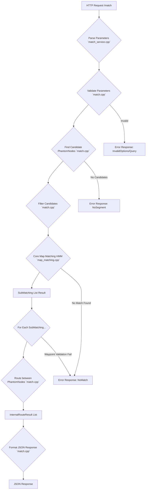
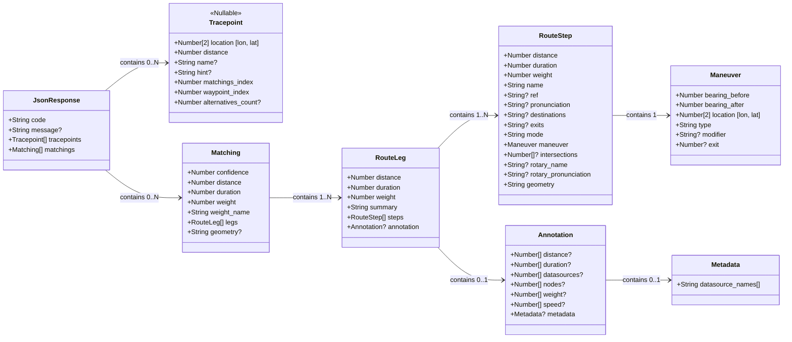

# OSRM Map Matching (`/match`) Service: Technical Documentation

NOTE: This file was generated by Google's Gemini.

## 1. Introduction

This document provides a detailed technical explanation of the OSRM (Open Source
Routing Machine) `/match` service, commonly known as map matching. It aims to
fill gaps present in the official documentation by analyzing the underlying C++
source code. The goal is to offer a comprehensive understanding of the internal
processing steps and the structure of the JSON response.

**Source Code References:**

This analysis is based on the following C++ files:

- `server/service/match_service.cpp`
- `engine/plugins/match.cpp`
- `engine/routing_algorithms/map_matching.cpp`
- `engine/map_matching/hidden_markov_model.hpp`
- `engine/map_matching/sub_matching.hpp`
- `engine/map_matching/matching_confidence.hpp`
- `engine/map_matching/bayes_classifier.hpp`
- Other related engine and utility headers included by these files.

## 2. Overall Process Flow

The `/match` service takes a sequence of input coordinates (a trace) and
attempts to snap them to the most likely sequence of road segments in the
underlying road network graph. The process involves several stages, from
parsing the request to generating the final matched route(s).

**Flow Description:**

1.  **HTTP Request:** An HTTP GET request is made to the
    `/match/v1/{profile}/{coordinates}` endpoint with various optional query
    parameters.
2.  **Parse Parameters (`match_service.cpp`):** The service parses the URL path
    and query string into an `engine::api::MatchParameters` struct. Invalid query
    syntax results in an `InvalidQuery` error.
3.  **Validate Parameters (`match.cpp`):** The `MatchPlugin` validates the
    parsed parameters. Checks include coordinate validity, timestamp monotonicity
    (if provided), parameter array sizes matching coordinate count, radius limits,
    and waypoint constraints (first/last points must be waypoints if specified).
    Optional parameter tidying may occur. Failure leads to an `InvalidOptions` or
    `InvalidValue` error.
4.  **Find Candidate PhantomNodes (`match.cpp`):** For each input coordinate,
    the plugin searches the road network graph (using spatial indices like R-trees)
    for nearby road segments within a specified radius. The radius comes from the
    `radiuses` parameter or a default value (often based on
    `DEFAULT_GPS_PRECISION`). The results are `PhantomNode` objects, representing
    potential snaps to the graph edges.
5.  **Filter Candidates (`match.cpp`):** The raw candidate `PhantomNode`s are
    filtered to improve matching quality: - Duplicates based on road segment IDs
    are removed. - If a U-turn is unlikely based on the angle between
    consecutive trace points, bidirectional road segments are split into
    separate forward and reverse candidates to prevent unrealistic snaps. -
    Candidates are sorted by distance. If no candidates remain after filtering
    for _any_ coordinate, a `NoSegment` error is returned.
6.  **Core Map Matching (HMM) (`map_matching.cpp`):** This is the heart of the process.
    A Hidden Markov Model (HMM) is used where:
    - _Hidden States_ are the true road segments the user traveled (`PhantomNode`s).
    - _Observations_ are the noisy input GPS coordinates.
      The Viterbi algorithm finds the most probable sequence of hidden states
      given the observations, based on emission and transition probabilities.
      Breaks in the HMM (due to large gaps or low probabilities) can result in
      the trace being split into multiple independent `SubMatching` results if
      `gaps=split` is requested. If no match can be found, a `NoMatch` error occurs.
7.  **SubMatching List Result:** The HMM process yields a list of `SubMatching`
    objects. Each `SubMatching` contains the sequence of matched `PhantomNode`s
    (`nodes`), the corresponding original trace indices (`indices`), and a
    calculated `confidence` score.
8.  **Route between PhantomNodes (`match.cpp`):** For _each_ `SubMatching`, the
    plugin iterates through the sequence of matched `PhantomNode`s. It calls the
    standard OSRM routing engine (`algorithms.ShortestPathSearch`) for each pair of
    consecutive `PhantomNode`s to compute the actual path, geometry, and annotations
    (like distance, duration, nodes) between them.
9.  **InternalRouteResult List:** The routing calls produce a list of
    `InternalRouteResult` objects, containing the detailed path information
    corresponding to each `SubMatching`. If waypoints were specified, validation
    occurs here, and legs might be collapsed. A `NoMatch` error can occur if
    specified waypoints aren't part of the matched result.
10. **Format JSON Response (`match.cpp`):** The `MatchAPI` class takes the
    `SubMatching` data (confidence, indices) and the `InternalRouteResult` data
    (legs, geometry, annotations) and constructs the final JSON object according to
    the API specification.
11. **JSON Response:** The final JSON object is returned to the client.

## 3\. Detailed Processing Steps

### 3.1. Request Handling & Parameter Parsing

The `MatchService::RunQuery` function receives the raw query string.
It uses `api::parseParameters<engine::api::MatchParameters>` to convert the
query parameters into a structured `MatchParameters` object.

This involves parsing coordinates, timestamps, radiuses, bearings, hints, gaps,
tidy, annotations, geometries, overview, steps, etc.

If parsing fails, it returns an `InvalidQuery` error with the approximate
position of the syntax error.

### 3.2. Input Validation

The `MatchPlugin::HandleRequest` function performs extensive validation:

- **Algorithm Availability:** Checks if map matching is supported by the
  configured routing algorithm (CH or MLD).
- **Coordinate Count & Validity:** Ensures at least two coordinates are provided
  and checks if coordinate values are within valid lat/lon ranges (`CheckAllCoordinates`).
- **Timestamp Monotonicity:** If timestamps are provided, verifies they are monotonically increasing.
- **Parameter Array Sizes:** Checks if optional arrays like `hints`, `radiuses`,
  `bearings`, `timestamps` have the same size as the `coordinates` array if
  provided (`getWrongOptionHelp` called via `parameters->IsValid()` check).
- **Maximum Locations/Radius:** Enforces configured limits
  (`max_locations_map_matching`, `max_radius_map_matching`) to prevent performance degradation.
- **Waypoint Constraints:** If the `waypoints` parameter is used, it ensures the
  first and last coordinates (indices 0 and N-1) are included in the waypoints list.
- **Parameter Tidying:** Optionally removes consecutive duplicate coordinates
  using `api::tidy::tidy` if `tidy=true`. A mapping (`tidied.mapping`) is kept to
  relate original indices to tidied indices.

### 3.3. Candidate Search

`GetPhantomNodesInRange` is called to find candidate road segments for each (potentially tidied) coordinate.
It searches the graph's spatial data structure (R-tree) using search radii determined as follows:

- If `radiuses` parameter is provided: Uses the value for that coordinate,
  multiplied by a constant (`RADIUS_MULTIPLIER`, often 3).
- If `radiuses` is not provided: Uses the `default_radius` configuration parameter if set and not -1.
- Otherwise: Defaults to `DEFAULT_GPS_PRECISION * RADIUS_MULTIPLIER`.
  `DEFAULT_GPS_PRECISION` is usually 5 meters, so the default search radius is
  often 15 meters.

This returns `CandidateLists`, where each list contains
`PhantomNodeWithDistance` structs for a coordinate, including the `PhantomNode`
(representing a point snapped to a graph edge) and the `distance` from the input
coordinate to the snapped point.

### 3.4. Candidate Filtering

The `filterCandidates` function refines the raw candidate lists:

1.  **Sorting & Uniqueness:** Candidates for each coordinate are sorted
    primarily by segment IDs and secondarily by distance. `std::unique` removes
    candidates snapped to the exact same position on the same directed edge segment.
2.  **U-Turn Handling:** It calculates the angle between the previous, current,
    and next trace points. If the angle indicates a sharp turn (potential U-turn),
    `allow_uturn` is set to true. If U-turns are _not_ allowed (the trace is
    relatively straight), and a candidate `PhantomNode` represents a bidirectional
    edge (`forward_segment_id.enabled` and `reverse_segment_id.enabled`), the
    function splits it:
    - The original candidate is modified to be forward-only (`reverse_segment_id.enabled = false`).
    - A new candidate representing the reverse direction
      (`forward_segment_id.enabled = false`) is added to the list. This prevents
      the HMM from matching a trace going straight onto the reverse direction of
      the same road.
3.  **Distance Sort:** Finally, candidates are sorted by `distance` to the input coordinate.

### 3.5. Core Map Matching (HMM)

The `mapMatching` function in `map_matching.cpp` implements the core logic using the `HiddenMarkovModel`.

- **Model Setup:** An `HMM` object is created, holding matrices for Viterbi
  probabilities, parent pointers, path distances, etc.. Emission log probabilities
  are pre-calculated for all candidates based on their distance to the input
  coordinate and the specified or default GPS precision (`sigma_z`). The emission
  probability follows a Gaussian distribution:
  $P(coord\_i | state\_j) \propto \exp(-\frac{distance(coord\_i, state\_j)^2}{2 \sigma\_z^2})$.
  The implementation uses the log probability for numerical stability.
- **Initialization:** The HMM is initialized at the first timestamp (`t=0`) or
  the first timestamp with non-pruned candidates. Initial probabilities are set
  based only on emission probabilities.
- **Viterbi Iteration:** The code iterates through subsequent timestamps (`t = 1` to `N-1`).
  For each potential state (candidate `s_prime` at time `t`) and
  each possible previous state (candidate `s` at previous time `prev_t`), it
  calculates the probability of transitioning from `s` to `s_prime`:
  1.  **Network Distance:** It computes the actual shortest path network
      distance (`network_distance`) between the `PhantomNode` for `s` and the
      `PhantomNode` for `s_prime` using the standard OSRM routing algorithm
      (`getNetworkDistance`, which internally uses `routing_base_ch` or
      `routing_base_mld`). A maximum weight (`weight_upper_bound`) prunes impossible
      routes early.
  2.  **Distance Difference:** It calculates the absolute difference (`d_t`)
      between this `network_distance` and the great-circle distance between the
      corresponding input coordinates (`trace_coordinates[prev_t]` and
      `trace_coordinates[t]`).
  3.  **Transition Probability:** The transition log probability is calculated
      using `TransitionLogProbability(d_t)`. This follows an exponential
      distribution $P(state\_j | state\_i) \propto \exp(-\frac{d\_t}{\beta})$,
      where `beta` controls how much deviation between network and trace distance is
      penalized.
  4.  **Total Probability:** The probability of reaching state `s_prime` via state `s` is calculated
      (in log space) as: `log P(s') = log P(s) + log P(transition s -> s') + log P(observation_t | s')`.
  5.  **Update & Pruning:** If this new probability is higher than the existing
      probability for state `s_prime`, the `viterbi` entry, `parent` pointer, and
      `path_distance` are updated. States with extremely low probabilities
      (`< MINIMAL_LOG_PROB`) are marked as `pruned`.
- **Handling Splits/Gaps:**
  - The algorithm checks for large gaps between consecutive (unbroken)
    timestamps (`step_time`) or too many consecutive broken states
    (`t - prev_unbroken_timestamp > MAX_BROKEN_STATES`).
  - If `allow_splitting` (controlled by the `gaps=split` API parameter) is true
    and a large time gap is detected (`step_time > max_broken_time`), a split is
    forced.
  - If the Viterbi calculation results in all candidates being pruned at a
    timestamp `t` (`model.breakage[t]` becomes true), the model backtracks to find
    the start of the breakage (`breakage_begin`).
  - When a split occurs (either forced by a gap or due to breakage), the current
    matching ends. The HMM state (`viterbi`, `parents`, etc.) is cleared from the
    split point onwards (`model.Clear`) and re-initialized (`model.initialize`) to
    start a new `SubMatching`.
- **Path Reconstruction:** After processing all timestamps, the algorithm finds
  the most probable state at the end of each `SubMatching` and backtracks using
  the `parents` pointers to reconstruct the most likely sequence of
  `PhantomNode`s. This sequence populates the `SubMatching.nodes` and
  `SubMatching.indices` fields.

### 3.6. Confidence Calculation

For each completed `SubMatching`, the confidence score is calculated:

1.  **Distances:** The total network distance (`matching_distance`) along the
    matched path (sum of `path_distances` from HMM) and the total great-circle
    distance (`trace_distance`) along the corresponding input trace segment are
    calculated.
2.  **Feature Calculation:** A feature value is computed as `distance_feature =
-std::log(trace_length) + std::log(matched_length)`. This captures the relative
    difference between the two lengths.
3.  **Bayes Classification:** The `MatchingConfidence` object uses a pre-trained
    `BayesClassifier`. This classifier takes the `distance_feature` and compares the
    probability density under two `LaplaceDistribution` models (one trained on
    "good" matches, one on "bad" matches) combined with an a priori probability of a
    match being good.
4.  **Confidence Score:** The classifier outputs the posterior probability of
    the match belonging to the "good" (positive) class, which is a value between 0
    and 1. This becomes the `confidence` value in the `SubMatching` and ultimately
    the `matchings[i].confidence` in the JSON response.

### 3.7. Route Generation

As noted earlier, after the HMM determines the sequence of `PhantomNode`s for a
`SubMatching`, the `MatchPlugin` calls `algorithms.ShortestPathSearch` for each
consecutive pair of nodes (`sub_routes[index].leg_endpoints`). This generates
the detailed route, including:

- Geometry (`LineString`).
- Distance and duration for each leg segment.
- Annotations (if requested), such as node IDs (`annotation.nodes`), segment
  distances (`annotation.distance`), durations (`annotation.duration`), weights,
  datasources, speed, etc.

### 3.8. Leg Collapsing

If the original request included the `waypoints` parameter, the
`CollapseInternalRouteResult` function merges consecutive route legs between the
specified waypoints. This simplifies the output `legs` array in the `matchings`
object to only show segments connecting the user-defined waypoints, rather than
segments between every matched tracepoint.

### 3.9. Response Formatting

The `api::MatchAPI::MakeResponse` function takes the list of `SubMatching`
objects and the corresponding list of `InternalRouteResult` objects and
constructs the final JSON output. It assembles the `tracepoints` array, linking
each tracepoint (or null) to its corresponding position within a `matching`'s
`legs` via `matchings_index` and `waypoint_index`. It populates the `matchings`
array with data from the `SubMatching` (confidence) and `InternalRouteResult`
(legs, distance, duration, geometry, annotations).

## 4\. Output JSON Schema

The OSRM `/match` service returns a JSON object.

**Field Explanations:**

- **`code`** (String): Status code. `"Ok"` indicates success. Other codes like
  `"NoMatch"`, `"TooBig"`, `"InvalidOptions"`, `"NoSegment"` indicate errors.
- **`message`** (String, Optional): An error message if `code` is not `"Ok"`.
- **`tracepoints`** (Array\<Tracepoint | Null\>): An array containing snapping
  information for each input coordinate, in the same order as the input.
  - **Element (Tracepoint Object | Null):**
    - If the input coordinate was matched to a road segment as part of a
      `SubMatching`, this is a `Tracepoint` object.
    - If the input coordinate could not be matched or was part of a segment
      removed during trace splitting/tidying, this entry will be `null`.
  - **`location`** (Array\<Number\>[2]): `[longitude, latitude]` of the point on
    the road network to which the input coordinate was matched (the PhantomNode
    location).
  - **`distance`** (Number): The straight-line distance (in meters) from the
    input coordinate to the matched `location` on the road segment. Corresponds to
    `PhantomNodeWithDistance.distance`.
  - **`name`** (String, Optional): The name of the street the coordinate was
    matched to. Derived during route generation.
  - **`hint`** (String, Optional): Hint for routing purposes, useful for
    subsequent requests (e.g., `/route`). Encodes information about the matched
    segment.
  - **`matchings_index`** (Number): The index (`0...M-1`) of the `Matching`
    object in the `matchings` array that this tracepoint belongs to.
  - **`waypoint_index`** (Number): The index (`0...L-1`) within the `legs` array
    of the corresponding `Matching` object where this tracepoint lies.
    Specifically, it indicates the _start_ of the leg that originates from this
    tracepoint's matched location. For the very last tracepoint of a matching,
    this index will equal the number of legs in that matching.
  - **`alternatives_count`** (Number, Optional): Number of alternative matchings
    considered for this tracepoint. Derived from `SubMatching.alternatives_count`.
    Usually 0 in recent versions unless specific alternative logic is
    enabled/present.
- **`matchings`** (Array\<Matching\>): An array of `Matching` objects. If the
  trace was not split, this array will contain a single element. If the trace was
  split (e.g., due to `gaps=split` or large inconsistencies), it will contain
  multiple `Matching` objects, each representing a contiguous matched portion of
  the trace.
  - **`confidence`** (Number): A score between 0 and 1 indicating the confidence
    in the correctness of this matching. Calculated using the `MatchingConfidence`
    logic based on trace vs. matched distance.
  - **`distance`** (Number): The total length (in meters) of the matched route
    path for this `Matching` object (sum of `legs[i].distance`). Calculated during
    the `ShortestPathSearch` phase.
  - **`duration`** (Number): The total estimated travel time (in seconds) for
    this `Matching` object (sum of `legs[i].duration`). Calculated during the
    `ShortestPathSearch` phase based on segment speeds and weights.
  - **`weight`** (Number): The total weight of the matched path according to the
    profile's weighting function (sum of `legs[i].weight`).
  - **`weight_name`** (String): The name of the weight profile used (e.g., `"routability"`, `"duration"`).
  - **`legs`** (Array\<RouteLeg\>): An array representing the segments of the
    matched path. Each leg connects two consecutive matched tracepoints (or
    user-defined waypoints if `waypoints` parameter was used and legs collapsed).
    - **`distance`**, **`duration`**, **`weight`**, **`summary`** (String):
      Aggregated values for this specific leg. `summary` is often deprecated or
      empty in newer OSRM versions.
    - **`steps`** (Array\<RouteStep\>): Detailed turn-by-turn instructions for
      traversing this leg. This is standard OSRM route representation.
      - **`distance`**, **`duration`**, **`weight`**, **`name`**, **`ref`**, **`pronunciation`**, **`destinations`**, **`exits`**, **`mode`**:
        Properties of the individual step.
      - **`maneuver`** (Object): Details about the turn or action required at
        the beginning of the step (type, modifier, location, bearings).
      - **`intersections`** (Array\<Number\>, Optional): Information about intersections along the step.
      - **`rotary_name`**, **`rotary_pronunciation`**: Details for roundabouts.
      - **`geometry`** (String): Encoded polyline (`polyline` or `polyline6`) or
        GeoJSON `LineString` representing the geometry of this step. Format
        depends on the `geometries` request parameter.
    - **`annotation`** (Annotation Object, Optional): Contains detailed data for
      each segment _within_ the leg, enabled by the `annotations=true` request
      parameter. This is crucial for detailed analysis.
      - **`distance`** (Array\<Number\>): Distance (meters) for each internal segment making up the leg.
      - **`duration`** (Array\<Number\>): Duration (seconds) for each internal segment.
      - **`datasources`** (Array\<Number\>): Index into
        `metadata.datasource_names` indicating the source of speed/duration data
        for each segment.
      - **`nodes`** (Array\<Number\>): A pair of OSM Node IDs `[u, v]` for each
        internal segment (Note: Your python code correctly interprets this as a
        flat list where pairs `nodes[2*i], nodes[2*i+1]` form segments).
      - **`weight`** (Array\<Number\>): Weight for each internal segment.
      - **`speed`** (Array\<Number\>): Speed (km/h) for each internal segment.
      - **`metadata`** (Object, Optional): Additional metadata.
        - `datasource_names` (Array\<String\>): List of data source names (e.g.,
          `"speed"`, `"duration"`) referenced by `datasources` indices.
  - **`geometry`** (String, Optional): Encoded polyline (`polyline` or
    `polyline6`) or GeoJSON `LineString` representing the _entire_ geometry of
    this `Matching` object. Format depends on the `geometries` request parameter,
    and presence depends on the `overview` parameter (`full`, `simplified`,
    `false`).

**Schema Notes:**

- **Null Tracepoints:** As mentioned, entries in the `tracepoints` array can be
  `null` if an input coordinate was not matched.
- **Optional Fields:** Fields marked with `?` (like `message`, `name`, `hint`,
  `ref`, `annotation`, `metadata`, `geometry` in `Matching`) may or may not be
  present depending on request parameters (`annotations`, `overview`,
  `geometries`) or whether an error occurred.
- **Annotations:** The `annotation` object within `legs` is particularly
  powerful for analysis but is only present if `annotations=true` is requested.
  Its arrays (`distance`, `duration`, `nodes`, etc.) provide data aligned with the
  _internal_ graph segments used to construct the leg's geometry, allowing
  detailed segment-by-segment analysis of the matched path. The `nodes` array
  contains pairs of OSM node IDs forming the underlying edges.
- **Geometry Format:** The `geometry` fields (in `steps` and `matchings`) will
  be strings formatted according to the `geometries` request parameter (default is
  `polyline`, `polyline6` or `geojson` are alternatives).
- **Steps:** The `steps` array provides turn-by-turn instructions. While useful
  for navigation, the core map matching result is often analyzed via the `legs`
  and `annotations`.

## 5. Conclusion

The OSRM map matching service employs a sophisticated process combining spatial
searching, candidate filtering, a Hidden Markov Model for probabilistic sequence
matching, and standard shortest path routing to generate detailed results.

Understanding the distinction between the HMM's role in finding the most likely
sequence of road segments (`PhantomNode`s) and the subsequent routing engine's
role in generating the geometry and annotations for that sequence is key to
interpreting the response correctly.

The `tracepoints` array provides the link between the input coordinates and the
resulting `matchings` structure, while the `confidence` score offers a valuable
metric for assessing the quality of the match.

This documentation, based on the source code, should provide a clearer picture
than previously available for developers working with the OSRM `/match` API.
