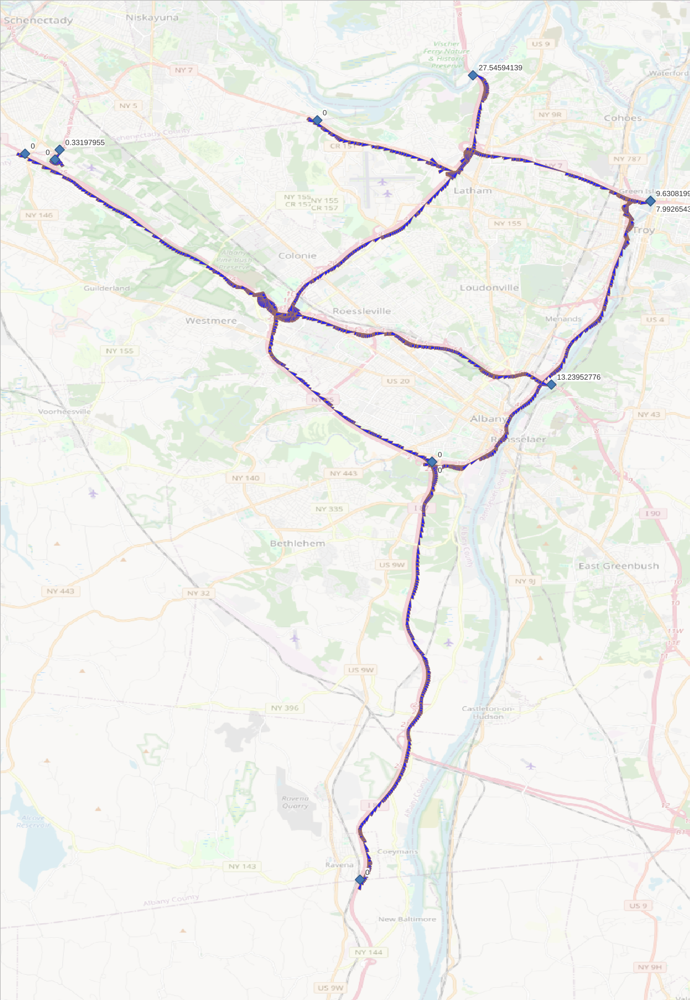
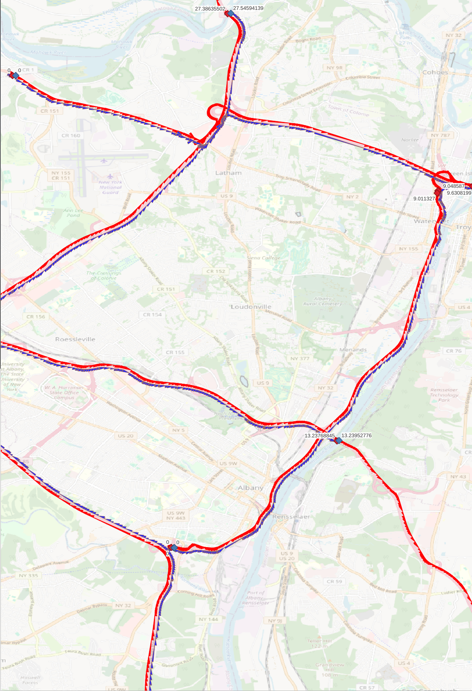
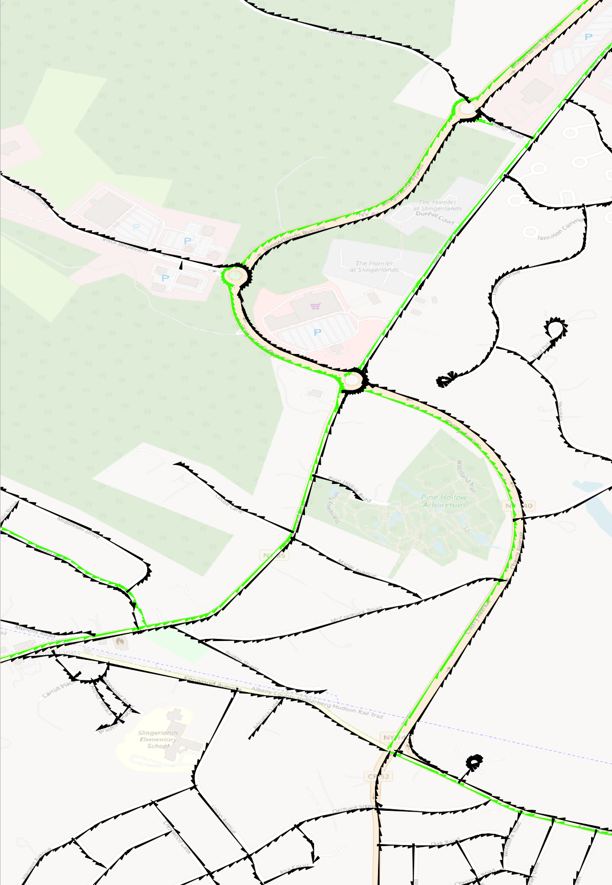

# RIS LRSN_Milepoint DIRECTION Codes

From [MEXIS_APP.BC_CONSULTING_NONAE_ADMIN](https://www.dot.ny.gov/portal/pls/portal/MEXIS_APP.BC_CONSULTING_NONAE_ADMIN.VIEWFILE?p_file_id=43687):

> - 0 - Primary Direction with Undivided Inventory
> - 1 - Primary Direction with Divided Inventory
> - 2 - Reverse Direction with Divided Inventory
> - 3 - Reverse Direction with No Inventory
>
> Direction 2 and 3 polylines are included to help determine where the reverse
> direction deviates enough from the primary direction to warrant additional
> collection in the reverse direction.

After inspecting the data in QGIS, I discovered the following:

1. The RIS Milepoint `MEASURE`s _ALWAYS_ ascend along the representative feature geometries.
2. Some geometries progress opposite the flow of traffic for the roads they represent.
3. DIRECTION=0 means the feature geometry **MAY** represent both directions of travel for two-way roads.
4. A DIRECTION=0 feature **MAY** have a complementary DIRECTION=3 road that represents the opposite direction.
   a. The coordinates of the two features will both flow in the same direction.
   b. For both features, MEASURE=0 will be near each other, and the measures will ascend together.
5. DIRECTION=1 and DIRECTION=2 features **ALWAYS** occur in pairs.
   a. DIRECTION=1 features **ALWAYS** flow in the direction of traffic.
   b. DIRECTION=2 features **ALWAYS** flow against the direction of traffic.
   b. These are generally used for divided interstates and trunk roads.

The visualizations below use the following symbology:

- **BLACK:** DIRECTION=0 roads
- **BLUE:** DIRECTION=1 roads
- **RED:** DIRECTION=2 roads
- **GREEN:** DIRECTION=3 roads

NOTE: The arrows point in the direction of the feature geometry,
not necessarily the flow of traffic along the roadway.

_The above image shows a single DIRECTION=0 road with its calibration points.
Notice the calibration point measures ascend along the feature geometry._

---

_The above image shows Albany County's DIRECTION=1 roads with their calibration points.
Notice the calibration point measures ascend along the feature geometries._

---

_The above image shows Albany County's DIRECTION=1 and DIRECTION=2 roads with their calibration points.
The respective calibration point icons share the color of the associated road.
Notice the calibration point measures ascend along the feature geometries,
even when for DIRECTION=2 features the geometry flows against road's traffic flow._

---

_The above image shows a sample Albany County's DIRECTION=3 roads with their calibration points.
Notice the calibration point measures ascend along the feature geometries._

_The above image shows a sample Albany County's DIRECTION=0 and DIRECTION=3 feature.
Notice the DIRECTION=3 feature are sparse and seemingly always occur with a DIRECTION=0 feature,
Whereas DIRECTION=1 feature are dense and occur mostly without a DIRECTION=3 pair._
